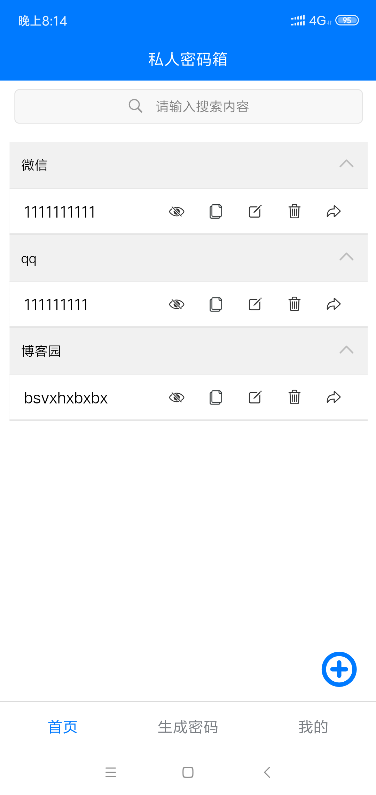
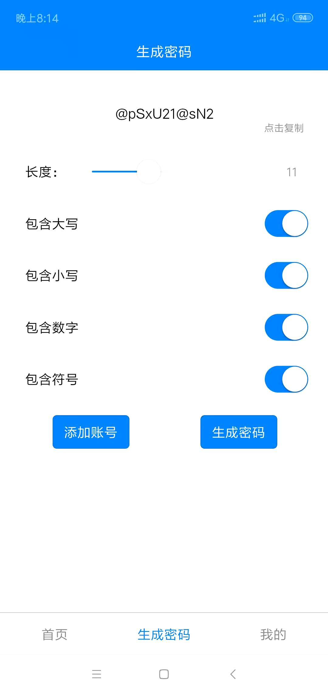
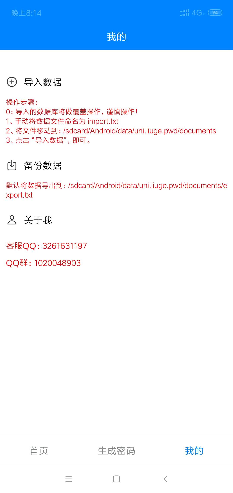
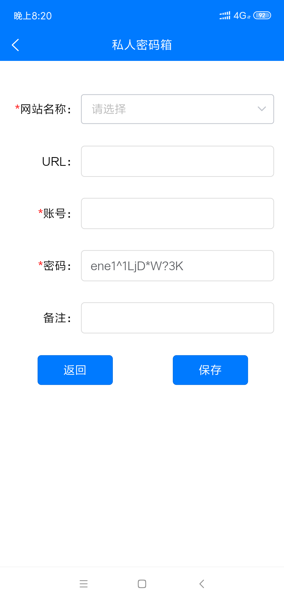

# uniapp_1password

基于uniapp构建的 1password-app，界面简洁友好，代码已开源。

目前只适配安卓，IOS未测试。

[下载地址：蓝奏网盘](https://wwa.lanzous.com/iwnbrjd429c) 

或者自行打包构建即可。

qq群：1020048903

`觉得好用，请给个Star！！`

## 功能介绍
1. 手势密码解锁
2. 快捷搜索功能
3. 快速复制各项内容
4. 一键生成各种组合的密码
5. 支持数据导入导出

## 动图演示

## 界面展示
首页

 

生成密码

 

我的

 

添加账号

 

## 参考链接

- [demo演示](https://hellouniapp.dcloud.net.cn/pages/component/view/view)
- [底部导航1](https://uniapp.dcloud.io/collocation/pages?id=tabbar)
- [底部导航2](https://ext.dcloud.net.cn/plugin?id=1799)
- [文件选择](https://ext.dcloud.net.cn/plugin?id=901)
- [下拉搜索](https://ext.dcloud.net.cn/plugin?id=518)
- [plus.io](https://www.html5plus.org/doc/zh_cn/io.html)
- [手势密码](https://ext.dcloud.net.cn/plugin?id=1623)

